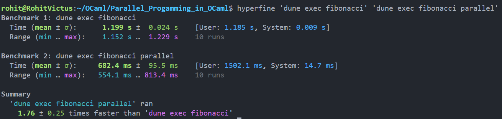
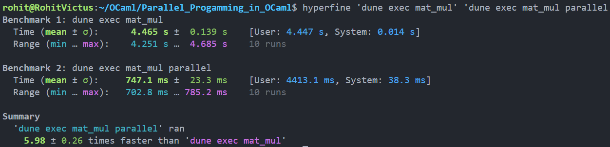
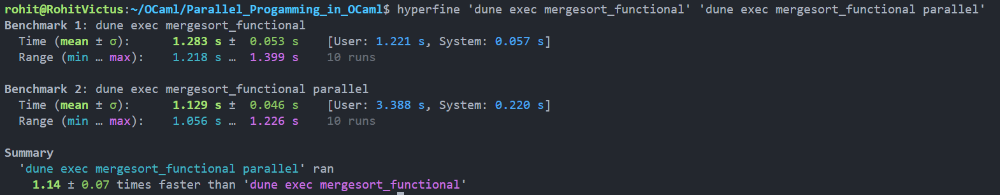
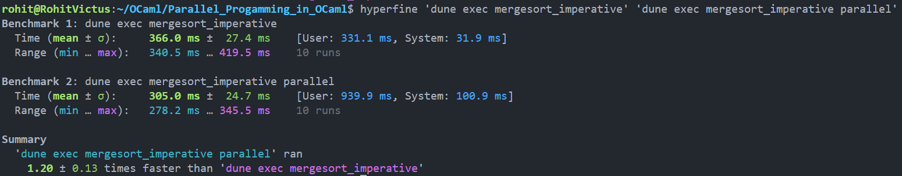

# Parallel Programming in OCaml

The project focuses on harnessing functional programming concepts in OCaml for parallel computing. Key elements include leveraging `OCaml Multicore` and `Domainslib` for parallelization, exploring features like higher-order functions and lazy evaluation, and implementing algorithms such as linear algebra operations, sorting algorithms, graph traversal, and Monte Carlo simulations. Benchmarking using `hyperfine` and unit testing are planned to evaluate performance and correctness, with a focus on comparing OCaml's functional approach with imperative solutions.


## Setup and Installation
```bash
git clone "https://github.com/RohitShah1706/Parallel_Progamming_in_OCaml.git"
cd Parallel_Progamming_in_OCaml

# Update opam
opam update
opam upgrade

# Install OCaml 5.0.0 for OCaml Multicore
opam switch create 5.0.0
eval $(opam env --switch=5.0.0)

# Development tools
opam install ocaml-lsp-server odoc ocamlformat utop

# Install Domainslib
opam install domainslib
```

## Running the Code
> Need to have OCaml v5.0.0 installed for Multicore OCaml to work. For this follow above instructions to create a new switch for OCaml v5.0.0
```bash
# Compile the code
dune build @all

# Run the code
# replace fibonacci with any other executables mentioned in bin/dune
dune exec fibonacci 

# in each executable provide parallel as argument to run parallel version
dune exec fibonacci parallel
```

## What are Domains
Domains are the basic unit of Parallelism in Multicore OCaml. They are heavy-weight entities. Each domain maps 1:1 to an operating system thread.

- `d = Domain.spawn (fun)` executes the given computation in parallel with the calling domain (parent).
- `Domain.join d` blocks until the domain `d` runs to completion. If the domain returns a result after its execution, `Domain.join d` also returns that value. If it raises an uncaught exception, that is thrown. When the parent domain terminates, all other domains also terminate. To ensure that a domain runs to completion, we have to join the domain.

> The MultiCore OCaml runtime(5.0.0) schedules aims to maximize the CPU utilization & overall system throughput by distributing domains across available CPU cores. 
- **Work Stealing**: idle CPU cores steal tasks from busy CPU cores to keep all cores active & evenly utilized.

## Domainslib
It provides support for nested-parallel programming. It provides async/await mechanism for spawning parallel tasks and awaiting their results. On top of this mechanism, it provides parallel iteration functions. At its core, it has an efficient implementation of work-stealing queue in order to efficiently share tasks with other domains.

### `Task.pool` v/s Domains
- Creating new domains is an expensive operation, so we should try to limit ourselves or even better reuse the already created Domains.
- `Task.pool`: allows execution of all parallel workloads in the same set of domains spawned at the beginning of the program.

```ocaml
open Domainslib

let pool = Task.setup_pool ~num_domains:3 ()
val pool : Task.pool = <abstr>
```

We created a new *task pool* with 3 new domains (including parent domain), thus a pool of total 4 domains. After the pool is setup, we can use it to execute all tasks we want to run in parallel.

### Arrays over Lists
Arrays are usually more efficient compared with lists in Multicore OCaml. Although they are not generally favoured in functional programming, using arrays for the sake of efficiency is a reasonable trade-off.

### `Task.parallel_for` 
Very helpful to parallelize iterative tasks. Look at `Async-Await` for parallel tasks. `Task.parallel_for` takes in a pool, starting & finish index (inclusive -> so `n-1` will work as finish index), body which is a function on `i`


### Pros & Cons of `Task.parallel_for`
- **IMPLICIT BARRIER** (PRO) - Any task waiting to be executed in the same pool will start only after all chunks in the `parallel_for` are complete. So don't have to worry about creating barriers to synchronize between two `parallel_for` loops.

- **ORDER OF EXECUTION NOT GUARANTEED** (CON) - `Task.parallel_for` makes the order of execution arbitrary & varies between two runs of the exact same code. So if there are any dependencies within the loop, like current result ($i^{th}$) depending on the previous result ($(i-1)^{th}$) then we might get wrong results.

## Benchmarking with `hyperfine`
We adopt a benchmarking approach similar to the tutorial, employing tools such as `hyperfine` to measure the performance of our parallel programs. By benchmarking various configurations and analyzing the outcomes, we can evaluate the scalability and efficacy of our parallelization strategies.  

`hyperfine` serves as a Linux tool utilized for benchmarking command-line commands. It incorporates features to evaluate the performance of individual commands in parallel.

Here are some benchmarks comparing the performance of sequential and parallel versions of the following algorithms:

### Fibonacci
```bash
hyperfine 'dune exec fibonacci' 'dune exec fibonacci parallel'
```


### Matrix Multiplication
```bash
hyperfine 'dune exec mat_mul' 'dune exec mat_mul parallel'
```


### Merge Sort Functional
```bash
hyperfine 'dune exec mergesort_functional' 'dune exec mergesort_functional parallel'
```


### Merge Sort Imperative
```bash
hyperfine 'dune exec mergesort_imperative' 'dune exec mergesort_imperative parallel'
```



## Authors

- [@RohitShah1706](https://www.github.com/RohitShah1706)
- [@Chandak-Keshav](https://www.github.com/Chandak-Keshav)
- [@Sunny-Kaushik](https://www.github.com/Sunny-Kaushik)